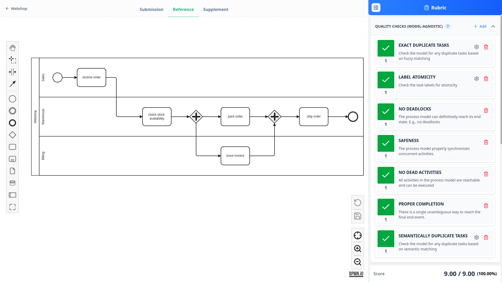
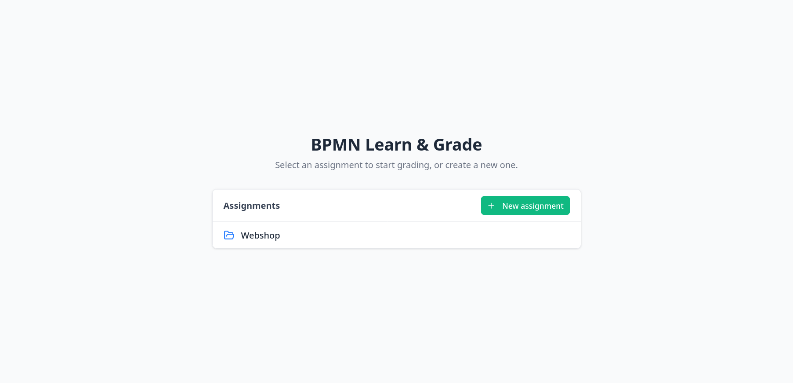
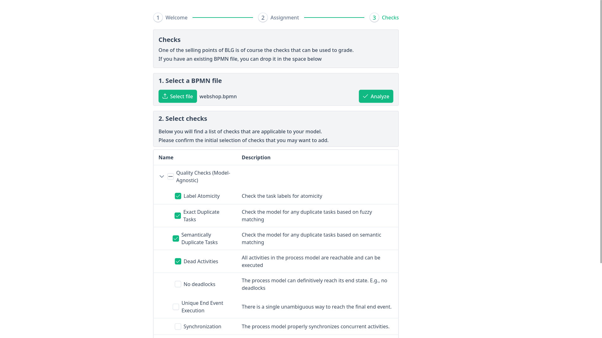
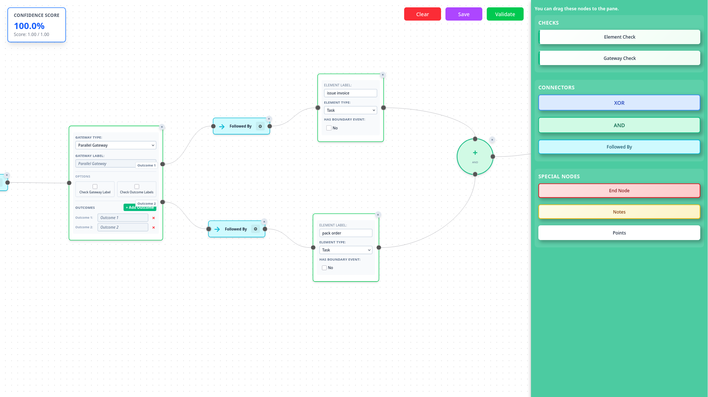

# BPMN Learn & Grade (BLG)

**BPMN Learn & Grade (BLG)** is a web-based tool for grading student BPMN (Business Process Model and Notation) submissions. BLG lets educators define rubrics, build behavioral validation rules, and grade student work against a reference model.



---

## Features

### Front-end (UI)
- **Assignment management**: A landing page to pick an existing assignment or create a new one; each assignment has its own rubric, rules, and submissions.
- **Submission upload**: Upload student `.bpmn` files directly from the grading interface, so no manual file copying is required.
- **Rubric management**: Define criteria with point values; supports simple checks and group criteria with XOR/AND logic.
- **Visual rule builder**: Node-based editor to build behavioral validation rules (element checks, gateway checks, connectors).
- **BPMN viewer**: Side-by-side view of student submission, reference model, and assignment PDF.
- **Auto-grading interface**: Grade submissions against rubric criteria; highlights non-compliant BPMN elements.
- **Onboarding wizard**: Step-by-step setup for uploading a reference model and configuring the initial rubric.

### Back-end (API)
- **Automated grading**: runs a configurable set of structural, semantic and behavioral checks against student BPMN submissions.
- **Behavioral rule engine**: graph-based workflow rules (nodes + edges) capture expected BPMN sequences; evaluated with AND/XOR branch logic.
- **Semantic similarity**: uses `sentence-transformers/all-mpnet-base-v2` for label matching so minor wording differences don't break grading.
- **Formal control-flow analysis**: deadlock and dead-activity detection.
- **Excel export**: per-submission and bulk grading results exportable as `.xlsx`.
- **Rule groups**: combine multiple behavioral rules under XOR (alternative solutions) or AND (all required) conditions.

---

## Screenshots

**Assignments landing page**: pick an existing assignment or create a new one:



**Onboarding wizard**: upload a reference model and configure the initial rubric:



**Visual rule builder**: build behavioral validation rules from a node-based editor:



---

## Prerequisites

| Tool | Purpose |
|---|---|
| Python ≥ 3.10 | Back-end runtime |
| Node.js ≥ 20 (or [Bun](https://bun.sh/)) | Front-end runtime |
| Docker | Containerized deployment (optional) |

> [`uv`](https://github.com/astral-sh/uv) (Python) and [`bun`](https://bun.sh/) (Node) are optional but recommended for faster installs. Where available they are used automatically on Linux/macOS via the Makefile.

---

## Installation & Running

### Docker (all platforms)

The easiest way to run the full stack on any operating system:

```bash
docker compose up --build -d   # build & start at http://localhost:8000
docker compose down
```

Because `docker-compose.yml` mounts `./backend/data` into the container, any assignments, rubrics, rules, and uploaded submissions you create in the web UI are saved to your local `backend/data` folder. The backend scaffolds the data layout (`assignments/` and a global `templates/`) on first run; each assignment gets its own `submissions/`, `rules/`, and rubric.

> **Linux:** you may need `sudo`, or add your user to the `docker` group first.

---

### Linux & macOS

A `Makefile` at the repo root simplifies setup and execution. It auto-detects `uv`/`pip` and `bun`/`npm`.

**1. Install all dependencies:**
```bash
make install
```

**2. Start the back-end** (data root defaults to `./data`, port 8000):
```bash
make run-backend
make run-backend DATA_DIR=my_class_data   # only needed for a non-default data directory
```

You don't normally need to set `DATA_DIR`; the back-end serves all your assignments from a single data root, and you pick or create individual assignments from the landing page in the web UI. Only override it if you want to keep your data somewhere other than `./data`. The back-end automatically creates the data root and initializes its folder structure if it doesn't exist.

**3. Start the front-end** dev server at `http://localhost:5173` (in a new terminal):
```bash
make run-frontend
```

**Production build** - compile the front-end and serve it from the back-end on port 8000:
```bash
make build-frontend
make run-backend
```

---

### Windows

The Makefile relies on Unix shell utilities and does not work natively on Windows. Use one of the options below.

#### Option A - WSL2 (recommended)

Install [WSL2](https://learn.microsoft.com/en-us/windows/wsl/install) with Ubuntu, then open a WSL terminal and follow the **Linux & macOS** instructions above.

#### Option B - PowerShell (manual)

```powershell
# --- Install ---
cd backend
pip install .                          # or: uv sync
cd ..\frontend
npm install                            # or: bun install

# --- Run back-end (from backend\) ---
python main.py ..\data                 # data root; assignments are managed from the web UI

# --- Run front-end (from frontend\, in a new terminal) ---
npm run dev                            # or: bun run dev

# --- Production build (from frontend\) ---
npm run build                          # or: bun run build
Remove-Item -Recurse -Force ..\backend\static
Copy-Item -Recurse dist ..\backend\static
```

---

## Using the app

Once the back-end and front-end are running, open the app in your browser and:

1. **Pick or create an assignment** on the landing page. Each assignment is self-contained (its own reference model, rubric, rules, and submissions) and lives under `assignments/` in the data root, so there's no need to point the back-end at a different data directory per class.
2. **Complete onboarding** for a new assignment: upload the reference BPMN model and configure the initial rubric.
3. **Upload student submissions** as `.bpmn` files from the grading interface.
4. **Grade** each submission against the rubric and export results to `.xlsx`.
